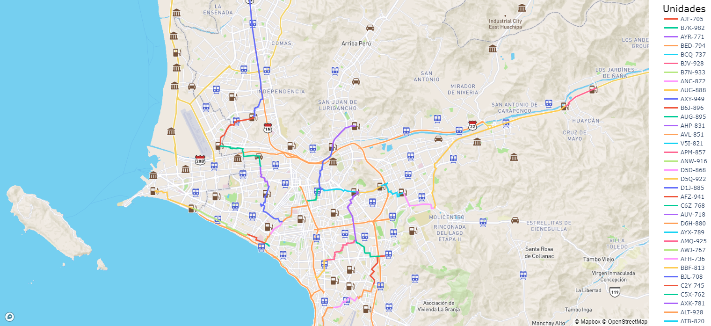
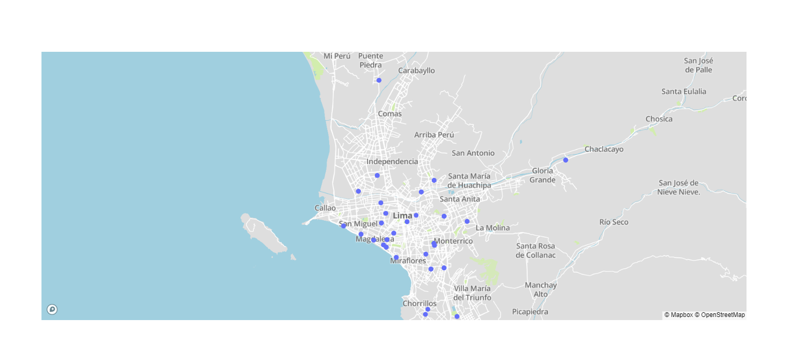
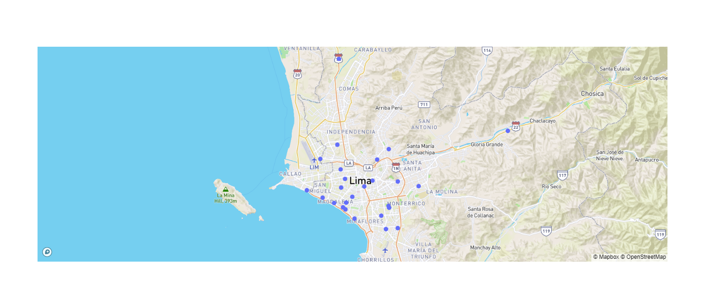
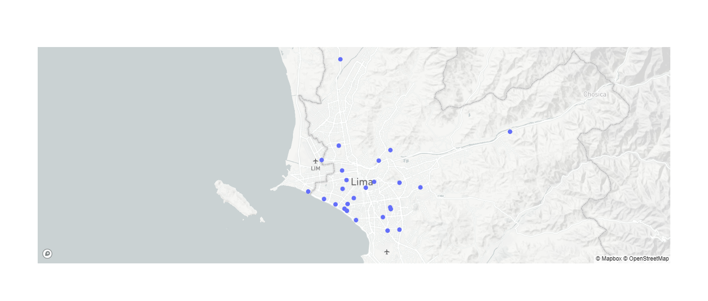
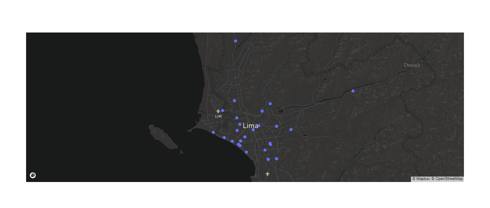
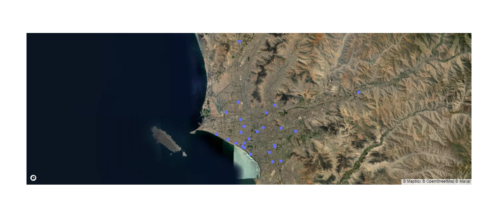
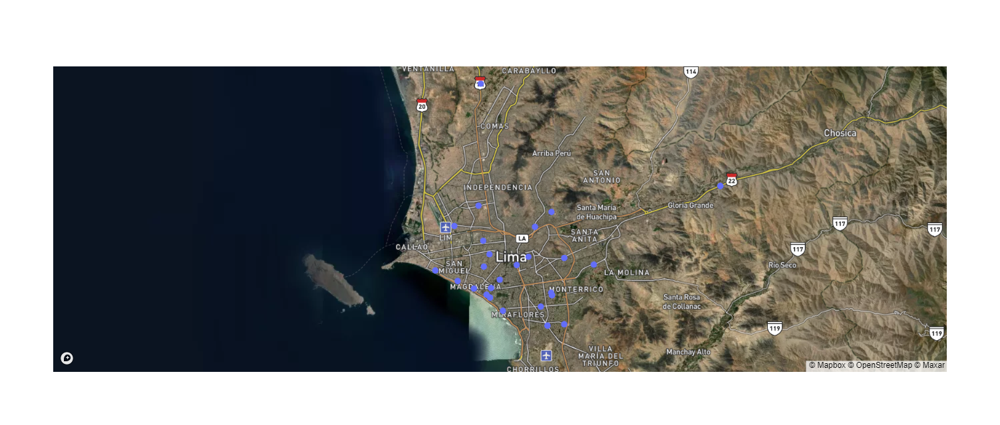

# Optimizacion de Programacion
Software para la programación de pedidos transportados hacia las estaciones de servicio.

## Dependencias del software
Ejecutar los siguientes comandos, usando Python 3.8.0 como base.
```
pip install pandas
pip install plotly
pip install requests
pip install openpyxl
pip install osmnx
pip install networkx
pip install cryptography
pip install geopy
```

## Rutas en el mapa
Las rutas por cada unidad se muestran de la siguiente manera.


## Modelos de mapas disponibles
Los modelos disponibles en las librería de Plotly son los siguientes.

### Modelo "basic"


### Modelo "streets"


### Modelo "outdoors"


### Modelo "light"


### Modelo "dark"


### Modelo "satellite"


### Modelo "satellite-streets"

