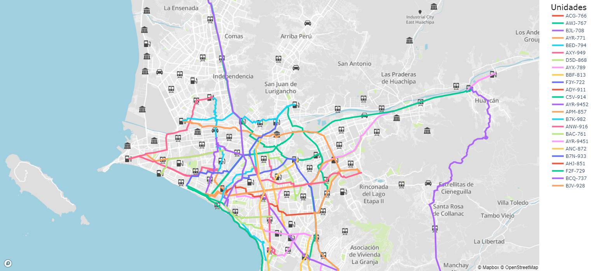

# Optimizacion de Programacion
Software para la programación de pedidos transportados hacia las estaciones de servicio.

## Requerimientos del software
Tener instalado Python 3.8 y ejecutar el siguiente comando en la carpeta donde se encuentre el programa.
```
pip install -r requirements.txt
```

## Uso del algoritmo TSP
Se ha usado el algoritmo TSP incluído en la librería ```mlrose``` para un caso de 44 estaciones COESTI, y se ha
obtenido la siguiente ruta.


## Distancias obtenidas del algoritmo TSP (44 estaciones)
**Distancia total _(con coordenadas)_:** 971.414 Km

**Distancia total _(con distancias)_:** 949.079 Km

## Optimización de recorrido global (44 estaciones)
Se ha optimizado el recorrido global, eliminando la arista de mayor longitud del recorrido obtenido por TSP,
obteniendo la siguiente mejora en la distancia del recorrido.

**Distancia sin eliminar arista mayor:** 949.079 Km

**Distancia eliminando arista mayor:** 808.853 Km

## Optimización de recorrido individual de cada unidad (44 estaciones)
Al igual que en el recorrido global, se ha optimizado la ruta individual de cada unidad, evitando que realice
recorridos más largos (para unidades que visiten más de dos estaciones), eliminando la arista de mayor longitud.
Se ha obtenido la siguiente mejora en el recorrido de cada unidad.

### Sin optimización
**Suma de distancia recorrida por todas las unidades:** 808.853 Km

**Promedio de distancia recorrida por cada unidad:** 36.766 Km

### Con optimización
**Suma de distancia recorrida por todas las unidades:** 666.901 Km

**Promedio de distancia recorrida por cada unidad:** 30.314 Km

## Ordenamiento de unidades por capacidad
Para el abastecimiento de todas las estaciones, se ha probado la diferencia entre comenzar asignando las unidades
de mayor a menor capacidad, o viceversa; obteniendo los siguientes resultados.

### Ordenando de mayor a menor capacidad
**Unidades utilizadas _(para 44 estaciones)_:** 22 unidades

**Suma de distancia recorrida por todas las unidades:** 666.901 Km

**Promedio de distancia recorrida por cada unidad:** 30.314 Km


### Ordenando de menor a mayor capacidad
**Unidades utilizadas _(para 44 estaciones)_:** 35 unidades

**Suma de distancia recorrida por todas las unidades:** 673.977 Km

**Promedio de distancia recorrida por cada unidad:** 19.256 Km


## Ejecución del programa
Durante la ejecución del programa, se mostrará cada una de las etapas del
programa, así como también los tiempos de ejecución de cada una de ellas. La manera
de mostrar las etapas es la siguiente.


## Tipos de mapas
Las rutas por cada unidad se pueden mostrar en los siguientes tipos de mapas.

### Modelo "basic"


### Modelo "streets"


### Modelo "outdoors"


### Modelo "light"


### Modelo "dark"


### Modelo "satellite"


### Modelo "satellite-streets"

