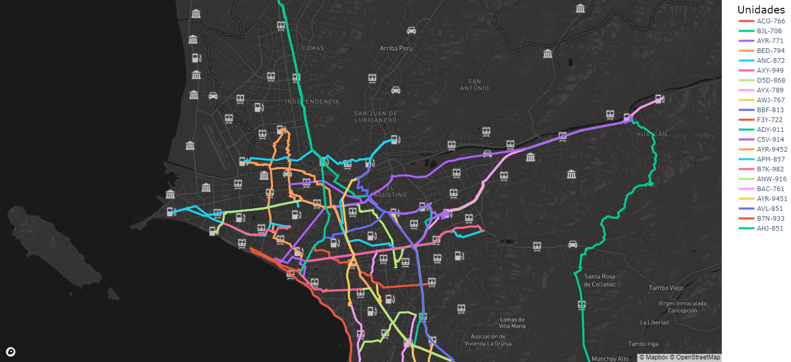
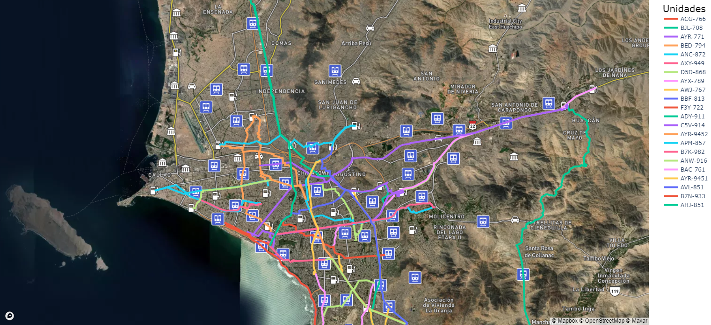

# Optimizacion de Programacion
Software para la programación de pedidos transportados hacia las estaciones de servicio.

## Requerimientos del software
Tener instalado Python 3.8 y ejecutar el siguiente comando en la carpeta del programa.
```
pip install -r requirements.txt
```

## Distancias y tiempos obtenidos del algoritmo TSP
### Usando coordenadas de entrada
**Distancia total:** 830.414300663492 Km

**Tiempo total:** 114.82 segundos

### Usando distancias de entrada
**Distancia total:** 808.8525647069278 Km

**Tiempo total:** 111.34 segundos

## Uso del algoritmo TSP
Se ha usado el algoritmo TSP incluído en la librería ```mlrose``` para un caso de 44 estaciones COESTI, y se ha
obtenido la siguiente ruta.


## Rutas por tipo de mapa
Las rutas por cada unidad se pueden mostrar en los siguientes tipos de mapas.

### Modelo "basic"


### Modelo "streets"


### Modelo "outdoors"


### Modelo "light"


### Modelo "dark"


### Modelo "satellite"


### Modelo "satellite-streets"


## Ejecución del programa
Durante la ejecución del programa, se mostrará cada una de las etapas del
programa, así como también los tiempos de ejecución de cada una de ellas. La manera
de mostrar las etapas es la siguiente.


